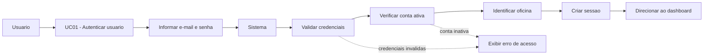

# UC01 - Diagrama - Autenticar Usuario

```mermaid
flowchart LR
    Usuario["Usuario"]
    Sistema["Sistema"]

    UC["UC01 - Autenticar usuario"]
    EmailSenha["Informar e-mail e senha"]
    Validar["Validar credenciais"]
    VerificarConta["Verificar conta ativa"]
    IdentificarOficina["Identificar oficina"]
    CriarSessao["Criar sessao"]
    Dashboard["Direcionar ao dashboard"]
    Erro["Exibir erro de acesso"]

    Usuario --> UC
    UC --> EmailSenha
    EmailSenha --> Sistema
    Sistema --> Validar
    Validar --> VerificarConta
    VerificarConta --> IdentificarOficina
    IdentificarOficina --> CriarSessao
    CriarSessao --> Dashboard
    Validar -. credenciais invalidas .-> Erro
    VerificarConta -. conta inativa .-> Erro
```

