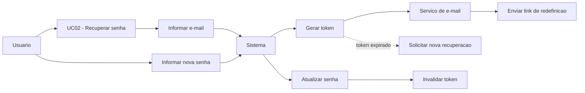

# UC02 - Diagrama - Recuperar Senha

```mermaid
flowchart LR
    Usuario["Usuario"]
    Sistema["Sistema"]
    Email["Servico de e-mail"]

    UC["UC02 - Recuperar senha"]
    InformarEmail["Informar e-mail"]
    GerarToken["Gerar token"]
    EnviarLink["Enviar link de redefinicao"]
    NovaSenha["Informar nova senha"]
    AtualizarSenha["Atualizar senha"]
    InvalidarToken["Invalidar token"]
    TokenExpirado["Solicitar nova recuperacao"]

    Usuario --> UC
    UC --> InformarEmail
    InformarEmail --> Sistema
    Sistema --> GerarToken
    GerarToken --> Email
    Email --> EnviarLink
    Usuario --> NovaSenha
    NovaSenha --> Sistema
    Sistema --> AtualizarSenha
    AtualizarSenha --> InvalidarToken
    GerarToken -. token expirado .-> TokenExpirado
```

