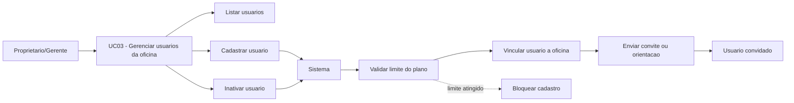

# UC03 - Diagrama - Gerenciar Usuarios Da Oficina

```mermaid
flowchart LR
    Gerente["Proprietario/Gerente"]
    Sistema["Sistema"]
    UsuarioConvidado["Usuario convidado"]

    UC["UC03 - Gerenciar usuarios da oficina"]
    Listar["Listar usuarios"]
    Cadastrar["Cadastrar usuario"]
    ValidarPlano["Validar limite do plano"]
    Vincular["Vincular usuario a oficina"]
    EnviarConvite["Enviar convite ou orientacao"]
    Inativar["Inativar usuario"]
    Bloquear["Bloquear cadastro"]

    Gerente --> UC
    UC --> Listar
    UC --> Cadastrar
    UC --> Inativar
    Cadastrar --> Sistema
    Sistema --> ValidarPlano
    ValidarPlano --> Vincular
    Vincular --> EnviarConvite
    EnviarConvite --> UsuarioConvidado
    ValidarPlano -. limite atingido .-> Bloquear
    Inativar --> Sistema
```

