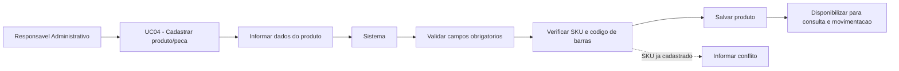

# UC04 - Diagrama - Cadastrar Produto/Peca

```mermaid
flowchart LR
    Administrativo["Responsavel Administrativo"]
    Sistema["Sistema"]

    UC["UC04 - Cadastrar produto/peca"]
    InformarDados["Informar dados do produto"]
    ValidarCampos["Validar campos obrigatorios"]
    ValidarUnicidade["Verificar SKU e codigo de barras"]
    Salvar["Salvar produto"]
    Disponibilizar["Disponibilizar para consulta e movimentacao"]
    Conflito["Informar conflito"]

    Administrativo --> UC
    UC --> InformarDados
    InformarDados --> Sistema
    Sistema --> ValidarCampos
    ValidarCampos --> ValidarUnicidade
    ValidarUnicidade --> Salvar
    Salvar --> Disponibilizar
    ValidarUnicidade -. SKU ja cadastrado .-> Conflito
```

