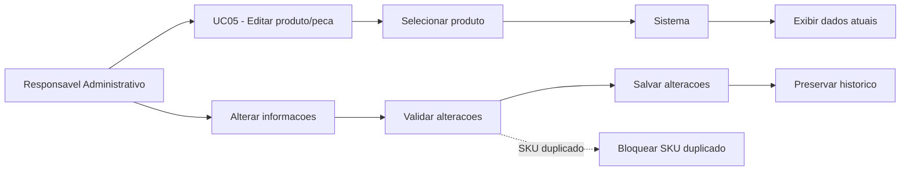

# UC05 - Diagrama - Editar Produto/Peca

```mermaid
flowchart LR
    Administrativo["Responsavel Administrativo"]
    Sistema["Sistema"]

    UC["UC05 - Editar produto/peca"]
    Selecionar["Selecionar produto"]
    ExibirDados["Exibir dados atuais"]
    Alterar["Alterar informacoes"]
    Validar["Validar alteracoes"]
    Salvar["Salvar alteracoes"]
    Preservar["Preservar historico"]
    Bloquear["Bloquear SKU duplicado"]

    Administrativo --> UC
    UC --> Selecionar
    Selecionar --> Sistema
    Sistema --> ExibirDados
    Administrativo --> Alterar
    Alterar --> Validar
    Validar --> Salvar
    Salvar --> Preservar
    Validar -. SKU duplicado .-> Bloquear
```

