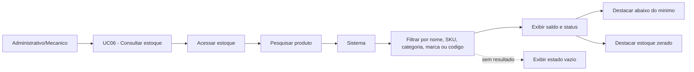

# UC06 - Diagrama - Consultar Estoque

```mermaid
flowchart LR
    Usuario["Administrativo/Mecanico"]
    Sistema["Sistema"]

    UC["UC06 - Consultar estoque"]
    Acessar["Acessar estoque"]
    Pesquisar["Pesquisar produto"]
    Filtrar["Filtrar por nome, SKU, categoria, marca ou codigo"]
    Exibir["Exibir saldo e status"]
    AlertaMinimo["Destacar abaixo do minimo"]
    AlertaZerado["Destacar estoque zerado"]
    Vazio["Exibir estado vazio"]

    Usuario --> UC
    UC --> Acessar
    Acessar --> Pesquisar
    Pesquisar --> Sistema
    Sistema --> Filtrar
    Filtrar --> Exibir
    Exibir --> AlertaMinimo
    Exibir --> AlertaZerado
    Filtrar -. sem resultado .-> Vazio
```

