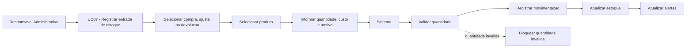

# UC07 - Diagrama - Registrar Entrada De Estoque

```mermaid
flowchart LR
    Administrativo["Responsavel Administrativo"]
    Sistema["Sistema"]

    UC["UC07 - Registrar entrada de estoque"]
    SelecionarTipo["Selecionar compra, ajuste ou devolucao"]
    SelecionarProduto["Selecionar produto"]
    InformarQuantidade["Informar quantidade, custo e motivo"]
    Validar["Validar quantidade"]
    Registrar["Registrar movimentacao"]
    AtualizarSaldo["Atualizar estoque"]
    AtualizarAlertas["Atualizar alertas"]
    Bloquear["Bloquear quantidade invalida"]

    Administrativo --> UC
    UC --> SelecionarTipo
    SelecionarTipo --> SelecionarProduto
    SelecionarProduto --> InformarQuantidade
    InformarQuantidade --> Sistema
    Sistema --> Validar
    Validar --> Registrar
    Registrar --> AtualizarSaldo
    AtualizarSaldo --> AtualizarAlertas
    Validar -. quantidade invalida .-> Bloquear
```

