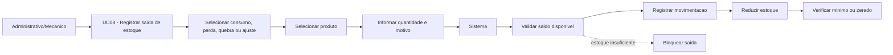

# UC08 - Diagrama - Registrar Saida De Estoque

```mermaid
flowchart LR
    Usuario["Administrativo/Mecanico"]
    Sistema["Sistema"]

    UC["UC08 - Registrar saida de estoque"]
    SelecionarTipo["Selecionar consumo, perda, quebra ou ajuste"]
    SelecionarProduto["Selecionar produto"]
    InformarQuantidade["Informar quantidade e motivo"]
    ValidarSaldo["Validar saldo disponivel"]
    Registrar["Registrar movimentacao"]
    Reduzir["Reduzir estoque"]
    VerificarAlertas["Verificar minimo ou zerado"]
    Bloquear["Bloquear saida"]

    Usuario --> UC
    UC --> SelecionarTipo
    SelecionarTipo --> SelecionarProduto
    SelecionarProduto --> InformarQuantidade
    InformarQuantidade --> Sistema
    Sistema --> ValidarSaldo
    ValidarSaldo --> Registrar
    Registrar --> Reduzir
    Reduzir --> VerificarAlertas
    ValidarSaldo -. estoque insuficiente .-> Bloquear
```

