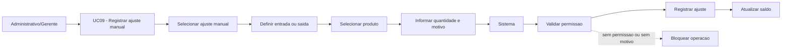

# UC09 - Diagrama - Registrar Ajuste Manual

```mermaid
flowchart LR
    Usuario["Administrativo/Gerente"]
    Sistema["Sistema"]

    UC["UC09 - Registrar ajuste manual"]
    SelecionarAjuste["Selecionar ajuste manual"]
    DefinirTipo["Definir entrada ou saida"]
    SelecionarProduto["Selecionar produto"]
    InformarMotivo["Informar quantidade e motivo"]
    ValidarPermissao["Validar permissao"]
    Registrar["Registrar ajuste"]
    AtualizarSaldo["Atualizar saldo"]
    Bloquear["Bloquear operacao"]

    Usuario --> UC
    UC --> SelecionarAjuste
    SelecionarAjuste --> DefinirTipo
    DefinirTipo --> SelecionarProduto
    SelecionarProduto --> InformarMotivo
    InformarMotivo --> Sistema
    Sistema --> ValidarPermissao
    ValidarPermissao --> Registrar
    Registrar --> AtualizarSaldo
    ValidarPermissao -. sem permissao ou sem motivo .-> Bloquear
```

