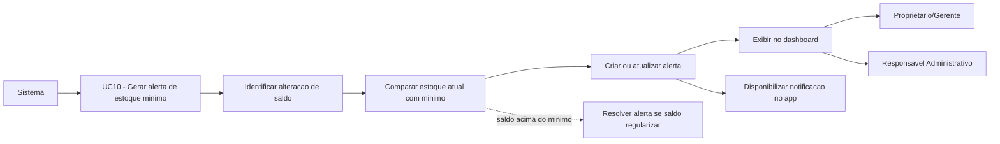

# UC10 - Diagrama - Gerar Alerta De Estoque Minimo

```mermaid
flowchart LR
    Sistema["Sistema"]
    Gestor["Proprietario/Gerente"]
    Administrativo["Responsavel Administrativo"]

    UC["UC10 - Gerar alerta de estoque minimo"]
    AlteracaoSaldo["Identificar alteracao de saldo"]
    Comparar["Comparar estoque atual com minimo"]
    CriarAlerta["Criar ou atualizar alerta"]
    ExibirDashboard["Exibir no dashboard"]
    NotificarApp["Disponibilizar notificacao no app"]
    Resolver["Resolver alerta se saldo regularizar"]

    Sistema --> UC
    UC --> AlteracaoSaldo
    AlteracaoSaldo --> Comparar
    Comparar --> CriarAlerta
    CriarAlerta --> ExibirDashboard
    CriarAlerta --> NotificarApp
    ExibirDashboard --> Gestor
    ExibirDashboard --> Administrativo
    Comparar -. saldo acima do minimo .-> Resolver
```

