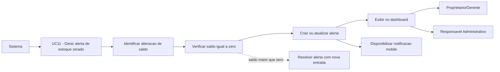

# UC11 - Diagrama - Gerar Alerta De Estoque Zerado

```mermaid
flowchart LR
    Sistema["Sistema"]
    Gestor["Proprietario/Gerente"]
    Administrativo["Responsavel Administrativo"]

    UC["UC11 - Gerar alerta de estoque zerado"]
    AlteracaoSaldo["Identificar alteracao de saldo"]
    VerificarZero["Verificar saldo igual a zero"]
    CriarAlerta["Criar ou atualizar alerta"]
    ExibirDashboard["Exibir no dashboard"]
    NotificarApp["Disponibilizar notificacao mobile"]
    Resolver["Resolver alerta com nova entrada"]

    Sistema --> UC
    UC --> AlteracaoSaldo
    AlteracaoSaldo --> VerificarZero
    VerificarZero --> CriarAlerta
    CriarAlerta --> ExibirDashboard
    CriarAlerta --> NotificarApp
    ExibirDashboard --> Gestor
    ExibirDashboard --> Administrativo
    VerificarZero -. saldo maior que zero .-> Resolver
```

