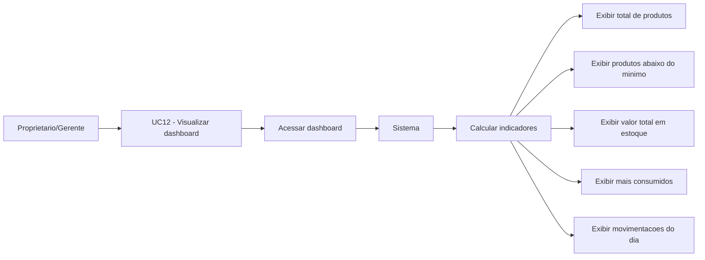

# UC12 - Diagrama - Visualizar Dashboard

```mermaid
flowchart LR
    Gerente["Proprietario/Gerente"]
    Sistema["Sistema"]

    UC["UC12 - Visualizar dashboard"]
    Acessar["Acessar dashboard"]
    Calcular["Calcular indicadores"]
    Produtos["Exibir total de produtos"]
    Minimo["Exibir produtos abaixo do minimo"]
    Valor["Exibir valor total em estoque"]
    Consumo["Exibir mais consumidos"]
    Movimentacoes["Exibir movimentacoes do dia"]

    Gerente --> UC
    UC --> Acessar
    Acessar --> Sistema
    Sistema --> Calcular
    Calcular --> Produtos
    Calcular --> Minimo
    Calcular --> Valor
    Calcular --> Consumo
    Calcular --> Movimentacoes
```

