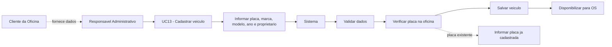

# UC13 - Diagrama - Cadastrar Veiculo

```mermaid
flowchart LR
    Administrativo["Responsavel Administrativo"]
    Cliente["Cliente da Oficina"]
    Sistema["Sistema"]

    UC["UC13 - Cadastrar veiculo"]
    InformarDados["Informar placa, marca, modelo, ano e proprietario"]
    Validar["Validar dados"]
    VerificarPlaca["Verificar placa na oficina"]
    Salvar["Salvar veiculo"]
    Disponibilizar["Disponibilizar para OS"]
    Conflito["Informar placa ja cadastrada"]

    Cliente -. fornece dados .-> Administrativo
    Administrativo --> UC
    UC --> InformarDados
    InformarDados --> Sistema
    Sistema --> Validar
    Validar --> VerificarPlaca
    VerificarPlaca --> Salvar
    Salvar --> Disponibilizar
    VerificarPlaca -. placa existente .-> Conflito
```

