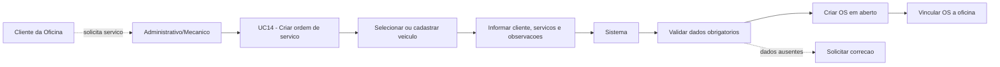

# UC14 - Diagrama - Criar Ordem De Servico

```mermaid
flowchart LR
    Usuario["Administrativo/Mecanico"]
    Cliente["Cliente da Oficina"]
    Sistema["Sistema"]

    UC["UC14 - Criar ordem de servico"]
    SelecionarVeiculo["Selecionar ou cadastrar veiculo"]
    InformarServico["Informar cliente, servicos e observacoes"]
    Validar["Validar dados obrigatorios"]
    Criar["Criar OS em aberto"]
    Vincular["Vincular OS a oficina"]
    Corrigir["Solicitar correcao"]

    Cliente -. solicita servico .-> Usuario
    Usuario --> UC
    UC --> SelecionarVeiculo
    SelecionarVeiculo --> InformarServico
    InformarServico --> Sistema
    Sistema --> Validar
    Validar --> Criar
    Criar --> Vincular
    Validar -. dados ausentes .-> Corrigir
```

