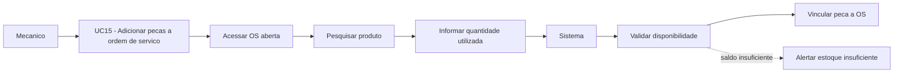

# UC15 - Diagrama - Adicionar Pecas A Ordem De Servico

```mermaid
flowchart LR
    Mecanico["Mecanico"]
    Sistema["Sistema"]

    UC["UC15 - Adicionar pecas a ordem de servico"]
    AcessarOS["Acessar OS aberta"]
    PesquisarProduto["Pesquisar produto"]
    InformarQuantidade["Informar quantidade utilizada"]
    ValidarEstoque["Validar disponibilidade"]
    Vincular["Vincular peca a OS"]
    Alertar["Alertar estoque insuficiente"]

    Mecanico --> UC
    UC --> AcessarOS
    AcessarOS --> PesquisarProduto
    PesquisarProduto --> InformarQuantidade
    InformarQuantidade --> Sistema
    Sistema --> ValidarEstoque
    ValidarEstoque --> Vincular
    ValidarEstoque -. saldo insuficiente .-> Alertar
```

