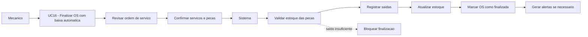

# UC16 - Diagrama - Finalizar Ordem De Servico Com Baixa Automatica

```mermaid
flowchart LR
    Mecanico["Mecanico"]
    Sistema["Sistema"]

    UC["UC16 - Finalizar OS com baixa automatica"]
    Revisar["Revisar ordem de servico"]
    Confirmar["Confirmar servicos e pecas"]
    ValidarEstoque["Validar estoque das pecas"]
    RegistrarSaidas["Registrar saidas"]
    AtualizarEstoque["Atualizar estoque"]
    Finalizar["Marcar OS como finalizada"]
    GerarAlertas["Gerar alertas se necessario"]
    Bloquear["Bloquear finalizacao"]

    Mecanico --> UC
    UC --> Revisar
    Revisar --> Confirmar
    Confirmar --> Sistema
    Sistema --> ValidarEstoque
    ValidarEstoque --> RegistrarSaidas
    RegistrarSaidas --> AtualizarEstoque
    AtualizarEstoque --> Finalizar
    Finalizar --> GerarAlertas
    ValidarEstoque -. saldo insuficiente .-> Bloquear
```

