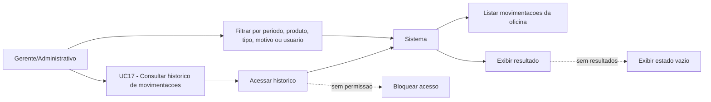

# UC17 - Diagrama - Consultar Historico De Movimentacoes

```mermaid
flowchart LR
    Usuario["Gerente/Administrativo"]
    Sistema["Sistema"]

    UC["UC17 - Consultar historico de movimentacoes"]
    Acessar["Acessar historico"]
    Listar["Listar movimentacoes da oficina"]
    Filtrar["Filtrar por periodo, produto, tipo, motivo ou usuario"]
    Exibir["Exibir resultado"]
    Vazio["Exibir estado vazio"]
    Bloquear["Bloquear acesso"]

    Usuario --> UC
    UC --> Acessar
    Acessar --> Sistema
    Sistema --> Listar
    Usuario --> Filtrar
    Filtrar --> Sistema
    Sistema --> Exibir
    Exibir -. sem resultados .-> Vazio
    Acessar -. sem permissao .-> Bloquear
```

