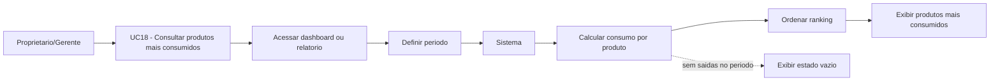

# UC18 - Diagrama - Consultar Produtos Mais Consumidos

```mermaid
flowchart LR
    Gerente["Proprietario/Gerente"]
    Sistema["Sistema"]

    UC["UC18 - Consultar produtos mais consumidos"]
    Acessar["Acessar dashboard ou relatorio"]
    DefinirPeriodo["Definir periodo"]
    Calcular["Calcular consumo por produto"]
    Ordenar["Ordenar ranking"]
    Exibir["Exibir produtos mais consumidos"]
    Vazio["Exibir estado vazio"]

    Gerente --> UC
    UC --> Acessar
    Acessar --> DefinirPeriodo
    DefinirPeriodo --> Sistema
    Sistema --> Calcular
    Calcular --> Ordenar
    Ordenar --> Exibir
    Calcular -. sem saidas no periodo .-> Vazio
```

