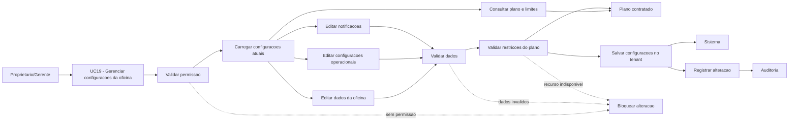

# UC19 - Diagrama - Gerenciar Configuracoes Da Oficina

```mermaid
flowchart LR
    Gerente["Proprietario/Gerente"]
    Sistema["Sistema"]
    Plano["Plano contratado"]
    Auditoria["Auditoria"]

    UC["UC19 - Gerenciar configuracoes da oficina"]
    Carregar["Carregar configuracoes atuais"]
    EditarDados["Editar dados da oficina"]
    EditarOperacao["Editar configuracoes operacionais"]
    EditarNotificacoes["Editar notificacoes"]
    ConsultarPlano["Consultar plano e limites"]
    ValidarPermissao["Validar permissao"]
    ValidarDados["Validar dados"]
    ValidarPlano["Validar restricoes do plano"]
    Salvar["Salvar configuracoes no tenant"]
    RegistrarAuditoria["Registrar alteracao"]
    Bloquear["Bloquear alteracao"]

    Gerente --> UC
    UC --> ValidarPermissao
    ValidarPermissao --> Carregar
    Carregar --> EditarDados
    Carregar --> EditarOperacao
    Carregar --> EditarNotificacoes
    Carregar --> ConsultarPlano
    EditarDados --> ValidarDados
    EditarOperacao --> ValidarDados
    EditarNotificacoes --> ValidarDados
    ConsultarPlano --> Plano
    ValidarDados --> ValidarPlano
    ValidarPlano --> Plano
    ValidarPlano --> Salvar
    Salvar --> Sistema
    Salvar --> RegistrarAuditoria
    RegistrarAuditoria --> Auditoria
    ValidarPermissao -. sem permissao .-> Bloquear
    ValidarDados -. dados invalidos .-> Bloquear
    ValidarPlano -. recurso indisponivel .-> Bloquear
```

